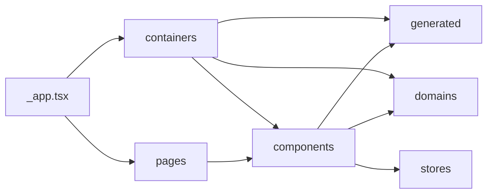

社外向けのSSP管理画面を新しくつくるプロジェクトに現在参画していました（2021年〜2023年）。メインとなる担当領域はフロントエンドですが、会社の文化的側面もありきっちりと分断されているわけではありません。よって自身がバックエンド（Golang）の実装に携わることもあります。

立ち上げの動機としては下記のようなものがあります。

- business面
  - 申し込みから広告の配信までをユーザー単独で行えるようにしたい
    - 現状は社内の人が絡むことで配信が行えるようになっていてスケールしづらい
  - レポート機能を改善したい
    - DBの構造上、無駄に画面を分ける必要が出てきたり、レガシーなUIで見づらい
    - 定期的なアンケートの結果が悪く、Google認定パートナーが撤回される可能性がある
  - 海外対応をしたい
- tech面
  - 社内・社外アプリケーションが同一のものなので分離させたい
  - レポート基盤をリモデリング・リアーキテクティングしたい

フロントエンドのトピックに絞ったDesign Docを外部向けに編集して下記に記述します。

# Design Doc

## Goal

- 顧客が自分たちのメディアで発生した広告配信実績のレポートを見ることができる
- 顧客自身で広告枠の管理・運用ができるようにする
- 海外の広告在庫を取り扱えるようにする

## Overview

### 主な利用技術

- [React](https://github.com/facebook/react)
- [Next.js](https://nextjs.org/)
- [Recoil](https://github.com/facebookexperimental/Recoil)
- [styled-components](https://github.com/styled-components/styled-components)
- [GraphQL](https://graphql.org/)
- [urql](https://github.com/FormidableLabs/urql)
- [next-i18next](https://github.com/isaachinman/next-i18next)

### アーキテクチャ概観

設計の概観は下記の通り。表記された文言はディレクトリ名に対応する(_app.tsxは除く)。
矢印は主な依存の方向を示している。
 
※Mermaid記法に対応していないので見辛いです。



#### _app.tsx

- https://nextjs.org/docs/advanced-features/custom-app
- Next.jsがページの初期化を行うためのコンポーネント
- どのルーティングでも必ず当コンポーネントが呼び出される

#### pages

- https://nextjs.org/docs/basic-features/pages
- https://nextjs.org/docs/routing/introduction
- 各ルーティングで表示したいコンポーネントが記述された場所
- ルーティングとディレクトリ構造が対応している

#### containers

- 各ルーティングに依存せず共通で表示したいコンポーネントを定義する(e.g. ヘッダー)
- [コンテクスト](https://ja.reactjs.org/docs/context.html)を用いたデータの共有の責務を担う

#### components

- pagesやcontainersから参照されるコンポーネント群を定義する
- 配下のディレクトリ構造は[Atomic Design](https://design.dena.com/design/atomic-design-%E3%82%92%E5%88%86%E3%81%8B%E3%81%A3%E3%81%9F%E3%81%A4%E3%82%82%E3%82%8A%E3%81%AB%E3%81%AA%E3%82%8B)に準拠

#### stores

- アプリケーション全体の状態を管理する責務を担う(e.g. loading状態)

#### generated

- 自動生成されたコードはこのディレクトリに入る(e.g. GraphQL Code Generator)

#### domains

- ドメイン知識に関連するインタフェース群が定義されている

## Detailed Design

### 設計方針

#### 技術の代替を容易にする

- Next.jsやGraphQLといった社内でも利用事例の少ない技術を取り入れている
- 利用事例の少ない技術は多い場合と比べ「特定のユースケースに未対応であることを後で知る」といったような不確実性が比較的高い
- よってそれらの代替が容易となる設計にする必要がある


#### 可読性の維持を最優先とする

- 社内にWebフロントエンドに造詣の深いエンジニアがいない
- Reactに触れて日の浅いエンジニアがコードに関してオーナーシップをもつ可能性がある
- 利用技術の中でもベーシックなAPIのみを利用するようにし、ニッチなAPIの利用はなるべく避ける

#### Clientの役目は表示とAPIへのリクエスト

- 事業ドメインが持つ振る舞いに関する知識はAPI側に移譲することでFrontend - Backend双方の関係をシンプルに保つ
  - Frontendが持つドメイン情報は「表示のためのインタフェース」にとどめる
- Clientの役目は下記に絞る
  - 必要な情報を取得して表示する
  - 必要な情報をまとめてAPI側にリクエストを送る

### components配下のディレクトリ構造について

components/〇〇/配下のコンポーネントは下記のような構造となっている。

```
./SomeComponent
├── _internal                    // SomeComponentからしか用いられないコンポーネント群
│   └── InternalComponent
│       └── constants.ts
│       └── …
├── constants.ts                 // SomeComponentでしか用いられない定数
├── index.tsx                    // SomeComponentの実装
├── styled.ts                    // styled-componentsを用いたコンポーネント群
└── types.ts                     // SomeComponentでしか用いられないインタフェース群
└── utils.ts                     // SomeComponentでしか用いられないユーティリティ関数
```

※加えて、`components/templates`および`components/pages`は`pages`に対応している。

例) `/some/path` というルーティングの場合
1. `pages/some/path.tsx`が読まれる
2. `pages/some/path.tsx`のなかで`components/pages/some/path/index.tsx`を用いてBackend APIとの通信やページ全体の状態管理を行う
2. `components/pages/some/path/index.tsx`のなかで`components/templates/some/path/index.tsx`を用いてUIを表示する

#### Atomic Designについて

components配下のディレクトリ構造は[Atomic Design](https://design.dena.com/design/atomic-design-%E3%82%92%E5%88%86%E3%81%8B%E3%81%A3%E3%81%9F%E3%81%A4%E3%82%82%E3%82%8A%E3%81%AB%E3%81%AA%E3%82%8B)に準拠している。しかし自社のコンポーネントライブラリである[ingred-ui](https://github.com/voyagegroup/ingred-ui)を利用していることから分類のルールが若干異なる。

- atoms
  - ingred-ui内のコンポーネントを0~1つ用いている
- molecules
  - ingred-ui内のコンポーネントまたはatoms配下のコンポーネントを2つ以上用いている
- organisms
  - molecules配下のコンポーネントを2つ以上用いている
- templates
  - ページ全体のスケルトンになるコンポーネント
  - pagesディレクトリ内で処理した情報を表示する責務をもつ
  - 先述の通りpagesディレクトリと対応したディレクトリ構造となる

他のプロジェクトを含め、organismsに分類されるコンポーネントが実装されたケースは社内にない。よってorganismsより大きな規模となるコンポーネントの分類はまだ行わない。

### 国際化について

Next.jsの諸機能と複数のNodeパッケージを用いてi18n(国際化)を実現する。

#### 使っているNext.jsの機能やNodeパッケージ

- [Internationalized Routing](https://nextjs.org/docs/advanced-features/i18n-routing)
- [react-i18next](https://github.com/i18next/react-i18next)
- [next-i18next](https://github.com/isaachinman/next-i18next)(`react-i18next`をNext.js上で利用しやすくするために作られたラッパー)

#### 文言の記述場所について

`client/public/locales`配下にあるJSONファイル群が、プロダクトで利用される文言を記述する場所にあたる。

現状はXLIFFなどの他のフォーマットに変換するスクリプトなどは書かれていない。依頼した翻訳会社がJSON以外のフォーマットを指定した場合は変換スクリプトを書いて変換する。

新たに言語を追加したい場合は同様にディレクトリを切って追加を行う。ディレクトリ構造は以下の通り。

```
locales
├── ja                    // 記述される言語コード
│   └── translation.json  // 言語コードに対応した翻訳が書かれたJSON
.
```

またそれぞれの JSON の構造は下記のようになっている。

```
{
  "<翻訳元の言語で書かれた文言>": "<翻訳先の言語で書かれた文言>",
  ...
}
```

### 状態管理について

※状態管理：UIに寄与するアプリケーション全体の状態に関する管理を指す(e.g. loading)

[Recoil](https://github.com/facebookexperimental/Recoil)を採用している。
storesディレクトリ配下に実装を記述しているが、利用元からはどのようなパッケージを利用しているかわからないように隠蔽する。

### GraphQLについて

Backend APIとのやりとりはGraphQLを用いて行う。

下記のディレクトリ内に書かれたGraphQLのOperationをベースにBackend APIとのやりとりを行うための実装は自動生成されるようにする。

- `components/pages`
- `containers`

自動生成された実装は、Operationが書かれた各ディレクトリ内および`generated/`内に格納される。

#### 利用技術

- [urql](https://github.com/FormidableLabs/urql)
- [graphql-code-generator](https://github.com/dotansimha/graphql-code-generator)

#### キャッシュに関して

不要な重複リクエストを避けるためにキャッシュは利用する。

しかし、キャッシュを効率的に保持するための追加実装は行わない。これは追加実装を行うことによる可読性の低下や起こりうる不具合を抑止するためである。

したがって[Normalized Caching](https://formidable.com/open-source/urql/docs/graphcache/normalized-caching/)ではなく、[Document Caching](https://formidable.com/open-source/urql/docs/basics/document-caching/)を採用する。

#### スキーマ設計に関して

社内に事例はないので[他社事例(同人誌)](https://booth.pm/ja/items/1576562)に沿って設計を行っていく方針。

書籍に書かれた通り、Relayの[GraphQL Server Specification](https://relay.dev/docs/guides/graphql-server-specification/)に準拠する。この意図は主に2つある。

- urqlから他の GraphQLクライアントへの乗り換えをある程度容易にしておきたい
- 規約をあらかじめ作っておくことでまとまりのある記述になる

### domainsについて

先述の通り、ドメイン知識に関連するインタフェース群が定義されている。システムの変更が影響することを避けるため、他のディレクトリの実装に依存することはしない。

Backend APIとのやりとりを行うためのインタフェースも、ドメインに関連する情報を作成・更新するためのものとして「ドメイン知識に関連するインタフェース群」と見なしている。

よってdomainsディレクトリ内の構造は以下のように定義する。

```
.hoge           // ドメイン知識に関連する情報のとある単位の名前
├── index.ts    // 直接的に関連する情報をインタフェースとして定義する場所
└── input.ts    // 直接的に関連する情報を作成・更新するためのインタフェース群
```

各ドメイン間で相互に参照することは問題ない（e.g. hogeディレクトリ内の記述が同じ階層にあるfugaディレクトリ内の記述を参照する）

### Testについて

下記の技術を用いてTest環境を実現する。

- [jest](https://github.com/facebook/jest)
- [@testing-library/jest-dom](https://github.com/testing-library/jest-dom)
- [@testing-library/react](https://github.com/testing-library/react-testing-library)

E2Eテストは導入・保守コストが高いので現時点では導入しない。またテストカバレッジは高い方が良いが、どのような実装に対してテストを導入すべきかといった基準を設けることは難しいので行わない。一方で導入が容易で効果が得やすいものに対しては積極的にテストを記述するようにする。例えば下記のような部分が挙げられる。

- `components/atoms/`, `components/molecules/`配下のコンポーネントに対するSnapshotテスト
- 認可が関わっているUIやロジック

## Alternative Considered

### Next.js vs Other

すでにあるプロダクトの開発で感じていた点は下記の通り。

- Webpackなどのツール群の保守に多くの工数を要する
  - esbuild導入で多少は改善されたがそれでもキャッチアップコストが高い
- 後々設定が増えたとしても、初期はzero-configでありたい
  - ほぼ自前のクライアントサイドルーティング実装の属人性が高い
  - 当時の筆者は写経などをしてクローンアプリ作ってようやく理解できた

極力configurationに手を入れたくない、という視点で挙がったバンドルツール群(内包型フレームワークも含む)

- [Parcel](https://github.com/parcel-bundler/parcel)
  - pros
    - zero-configで利用できる
  - cons
    - productionでの利用事例がかなり少ない印象(趣味などの開発で用いる機会が多い)
    - 少しでも凝ったことをすると破綻する
- [Next.js(Webpack)](https://github.com/vercel/next.js)
  - pros
    - zero-configで利用できる
    - webpackの設定をoverrideできるので凝ったことも可能
  - cons
    - 用件によっては設定をoverrideしすぎて堂々巡りになる

※[Remix(esbuild)](https://github.com/remix-run/remix)も候補として挙げられるが選定当初(2021年11月)は筆者の目に留まらなかった。比較的新しいフレームワークなため情報が少ない。よって候補に挙がったとしても選定する可能性は低いと考えている。

productionでの利用を考慮して、ある程度の自由度(想定外の要件にも耐えうる機能を備えたもの)を選びたい。よってNext.jsに軍配があがる。

Routingライブラリに関して、書き込むコードが少なく済むのはFile-Based Routingだが、これをサポートしているライブラリはNext.js(のビルトイン機能)以外に見つからなかった。[この記事](https://omarelhawary.me/blog/file-based-routing-with-react-router)のようなハックな手法は存在するが、先述の背景によりNext.jsを利用する意向もあるので、Routerに関してはNext.jsの機能に乗っかる方針にした。

### GraphQL vs Other

※IssueのURLが貼られていたので、ざっくりとした概要を記述している。

既存プロダクトであった「Open API周辺技術の使いづらさ（OpenAPI Generatorなど)」がきっかけでGraphQLが検討に挙がった。
具体的な使いづらさとしては下記となる。

- OpenAPI Generatorで生成されるコードの質が良くない
  - PHP（Slim）のコード生成が既存のプロダクトでの記述方法と噛み合わない
  - TypeScript（with axios）で生成されたコードがESLintで引っかかるので、生成後に上書きをしている
- スキーマ定義のyamlファイルが書きづらい
  - ファイル分割を仕様としてサポートしていない

GraphQLのほかにProtocol Buffersが比較対象として挙がったが前者を採用している。その背景が下記に記されている。

https://zenn.dev/yutaro1031/scraps/a048de87ed98cd

### urql vs Other

メジャーなGraphQLクライアントとして、選択肢は3つあった。([参考](https://hasura.io/blog/exploring-graphql-clients-apollo-client-vs-relay-vs-urql/))

- [React Apollo](https://github.com/apollographql/react-apollo)
  - pros
    - 利用者が多く情報が多い
    - 機能が豊富
      - 状態管理ライブラリとしての機能
      - 正規化されたキャッシュ機構
  - cons
    - バンドルサイズが他と比べて大きい
- [Relay](https://github.com/facebook/relay)
  - pros
    - 規約によるスケーリング担保
  - cons
    - バンドルサイズが他と比べて大きい
    - スキーマ・クエリ設計が縛られる
- [urql](https://github.com/FormidableLabs/urql)
  - pros
    - バンドルサイズが小さい(他と比較して3分の1以下)
    - シンプルなキャッシュ機構([Document caching](https://formidable.com/open-source/urql/docs/basics/document-caching/))
  - cons
    - 状態管理やページネーションなどを自前で実装する必要がある
    - 他と比べてコミュニティが活発ではない

設計方針より、可読性の高さや代替容易性を重視するので担う機能は少ない方が望ましい。よってurqlを採用した。

### react-i18next vs Other

候補は下記のようになった([こちらの記事](https://eight-bites.blog/2021/05/gatsby-react-i18n/)を参考)

- [react-intl](https://www.npmjs.com/package/react-intl)
  - pros
    - 大体の機能が揃っている(e.g. [通貨や時間をよしなに表示してくれる](https://formatjs.io/docs/react-intl/components/))
    - 圧倒的に人気なので情報が多い
  - cons
    - [このJSON](https://www.i18next.com/misc/json-format#i18next-json-v4)の`keyDeep`キーのようなネストした構造体を処理できない
- [react-i18next](https://github.com/i18next/react-i18next)
  - pros
    - [このJSON](https://www.i18next.com/misc/json-format#i18next-json-v4)の`keyDeep`キーのようなネストした構造体を処理できる
    - [next-i18next](https://github.com/isaachinman/next-i18next)を用いることで少ない記述で国際化を実現できる
  - cons
    - 通貨や時間の変換機能はなく、自前で実装する必要がある
- [(js-lingui)](https://github.com/lingui/js-lingui)
  - 軽量性がウリだが他の2つと比較するとシェアが少ない
  - 情報が少なくて開発が滞る予感がしたので早い段階で候補から外れた

ネストした構造体で定義することで可読性を向上させるために`react-i18next`を採用した。
しかし文言の重複による余分な記述が増加が増えてしまうので現在はフラットな構造になっている。

`react-i18next`に対するデメリットは現状ないので、ライブラリを変更することは考えていない。

### Recoil vs Other

候補として挙がったのは下記の通り。

- React.Context(自前で書く)
  - pros
    - 他のライブラリを利用しないので保守性をコントロールできる
  - cons
    - ライブラリ利用と比べてソースコードの記述量が多くなる
    - 状態管理に関する設計を行わなければならない(Context1つに状態を閉じ込めるか、など)
- [Recoil](https://github.com/facebookexperimental/Recoil)
  - pros
    - 自前で書くより圧倒的にシンプルに記述できる
  - cons
    - 実験的なライブラリであること以外は特に見当たらない
- ([Redux](https://github.com/reduxjs/redux))
  - 下記の理由から候補から外れている
    - キャッチアップにかなりの時間を要する
    - 冗長なコードが増えてしまい、保守性が低いコードになってしまう
    - 過去に既存プロダクトでの利用を取りやめたことがある

総合的にみてRecoilが妥当だと判断。

### Why Atomic Design

自身がjoinしてからAtomic Desingを採用し続けているが、いまだに設計が原因となる負債を発見できていない。故にわざわざリスクをとって別の設計を取るという判断をとっていない。

